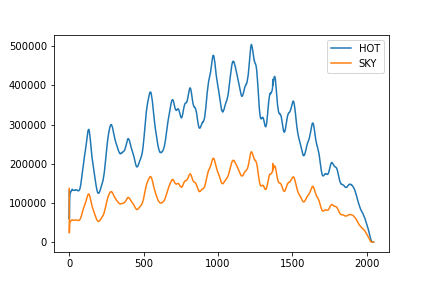
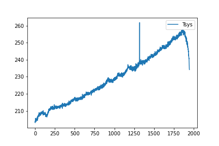
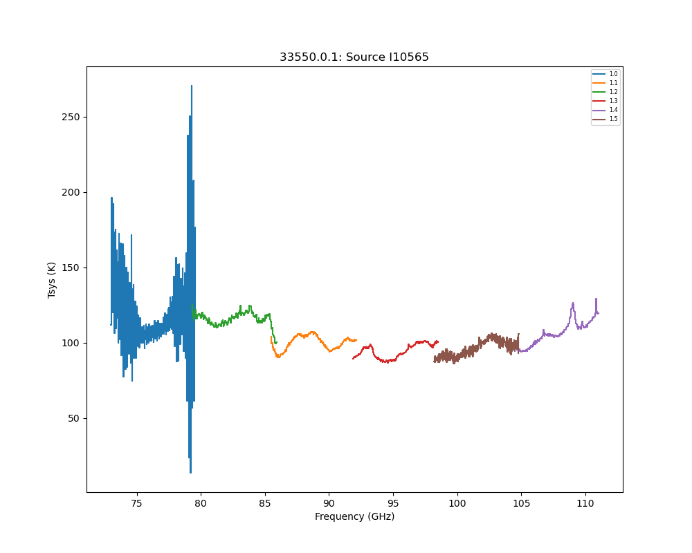
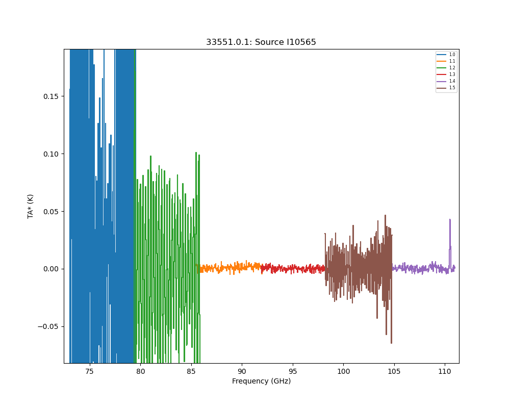

# Algorithms

## TA 

The typical way a single dish signal (normally represented in Kelvin) is computed is with an ON/OFF comparison:

      (eq. 1)    TA = Tsys * (ON-OFF)/OFF

where Tsys is a calibrated system temperature.

## CAL

The Tsys in turn is computed by comparing a "HOT" and "SKY" load, where the ambient temperature (Tamb) is known
from a sensor, or in case of SLR, hardcoded at 280K:

      (eq. 2)    Tsys = Tamb * SKY / (HOT-SKY)

In theory Tsys is a spectrum, but there is an option in the code to make it a scalar (not the default).
Also the way how a single HOT and SKY are computed from several samples (e.g. 20-ish in case of Sequoia)
could be tuned, currently a median is used.

RSR has a 1 KHz sampler, but data are accumulated to ~ 30sec before written and processed. Also recall the RAW data
for RSR are LAGS, not a SPECTRUM as for SEQ/SLR.

## DATA

In a typical LMT data set the channel based data can be thought of dimensioned, of which some of it we can find
back in the various data structures. We are using python notation, where the last dimension runs fastest:

     SLR:      DATA[ntime, npixel, nchan]                   e.g. [inttime/0.1, 16, 2k - 8k]   ~ 2-20GB

     RSR:      AccData[ntime,nchassis,nboard,nchan]         e.g. [inttime/32, 4, 6, 256]      ~ 10 MB
               RefData[ntime,nchassis,nboard,nchan]

For both instruments the data is actually in different files:   4 for SLR (4 pixels per 4 roach boards), and 4 for RSR
(there are 4 chassis). The various data structures are of course not exactly the simplistic sketch of the
multi-dimensonal array mentioned here. However, sometimes to processing large amounts of data (e.g. for SLR) it is
useful to review this in terms of any potential parallel (e.g. OpenMP) processing.

For Sequioa the ifproc and roach data are sampled at 125 Hz and 10 Hz resp., have different timestamps and thus
need to be aligned to build the **data[]** for further calibration and analysis. This interpolation process is
somewhat expensive. Effective processing speed is about 20-40 MB/sec for this *process* step.
The result of each roach board having its own time is that the ntime dimension in the DATA is not the same, they
typically differ by 1. It is thus easier to write this in the SDFITS notation: a series of spectra with - in this
case - (dRA,dDEC) meta data. There is only one band and one polarization:

     SLR:    ra,dec,board,band,pol,pixel,time,data[nchan]
             NT  NT     1    1   1     1    1     2k-4k

here NT ~ npixel (=16) * ntime (~1e4)

     RSR:    ra,dec,board,band,pol,pixel,time,data[nchan]
              1   1     4    6   1     1   10      256

Given the SDFITS agreement a spectrum based data structure that could be written as

      SpectralData[ra,dec,band,pol,chan]

where effectively each parameter (but not all at the same time?) can be 1 value. For LMT:

1. SLR/OTF :  ra,dec>1 board=1 band=1  pol=1  chan=2k,4k,8k
1. SLR/BS  :  ra,dec=1 board=1 band=1  pol=1  chan=2k,4k,8k
1. SLR/PS  :  ra,dec=1 board=1 band=1  pol=1  chan=2k,4k,8k
1. SLR/OTF :  ra,dec>1 board=1 band=1  pol=1  chan=2k,4k,8k
2. RSR     :  ra,dec=1 board=4 band=6  pol=1  chan=256
3. OMAYA   :  ra,dec>1 board=1 band=1  pol=2  chan=2k,4k,8k

## OPS

Various operations are needed on spectra.

1. flagging

1. smoothing

1. binning

1. trimming

1. baselining

1. fitting

1. gridding to a spatial domain

1. exporting to FITS/CLASS/ECSV

We differentiate a number of data operations here:

1. **Process**:  this is the process that converts RAW data files (taking into account different instruments)
into SDFITS format for any of the following (two) operations

1. **Operations**:  these are the operations (flagging, smoothing, ...) that define the data good enough for
either Stacking or Gridding.

1. **Stacking**: naively this applies to data such as taken with the RSR. Spectra are all taken at the same sky position,
and eventually the good spectra will be stacked to gain S/N. This results in a single spectrum, and common
formats for output are ECSV and 1D FITS. Another word for **stacking** could be **reduction**, i.e. pure
1/sqrt(N) averaging.

1. **Gridding**: naively this applies to data such as taken with the LSR. Spectra at different arbitrary sky positions
in a region of the sky are convolved and gridded on a regular grid. The common output format for this
is the popular 3D FITS cube. Stitching together the different bands of the RSR is also an example of **Gridding**

Advanced topics such as stacking grids, and using IFU type concepts such as used by the MUSE instrument, can be discussed
later.

## STATS

## Correspondence Table

Here's a reminder (not complete) on where in the code the fundamental algorithms and operations are:

      TA (eq.1)   lmtslr.spec.RoachSpec.reduce_spectra()

      CAL (eq.2)  lmtslr.spec.RoachSpec.compute_tsys_spectra()  - for CAL_in_MAP
                  lmtslr.spec.RoachSpec.compute_tsys_spectrum() - for CAL_before_MAP
		  dreampy3.redshift.netcdf.calibration_scan.process_astronomical_calibration()

		  

      STATS       lmtslr.spec.LineStatistics
      
      OPS:
                  lmtslr.spec.RoachSpec.baseline()
                  lmtslr.reduction.line_reduction.Line.baseline()
                  lmtslr.reduction.line_reduction.Line.line_stats()
                  lmtslr.reduction.line_reduction.Line.smo()
                  lmtslr.reduction.line_reduction.LineData.cslice()
                  lmtslr.reduction.line_reduction.Accum.load()
                  lmtslr.reduction.line_reduction.Accum.ave()
                  dreampy3.utils.smoothing.rebin()
                  dreampy3.utils.curve_fitting.Gauss1DFit()
                  dreampy3.utils.two_gaussian_fit.two_gaussian_fit()
                  dreampy3.redshift.utils.spectrum_utils.makespectrum()
                  dreampy3.redshift.utils.spectrum_utils.
		  		  		  
		  
		  
## Parameters

The lmtoy_reduce.md document described the parameters for SLR, which to some degree could guide us
to the RAW -> SDFITS conversion and what parameters are part of that conversion. A more advanced working
document is in **lmtoy_reduce_Parameters_v3.docx** (WIP)
Obviously a similar step is needed for RSR and the parameters will be different.

The **obsnum** is what all data have in common, as well as combining a series of them to make
a final spectrum/cube.

### RSR Process:

The step from RAW to Spectrum has the following parameters:

| Keyword        | Description  |
| -----------    |:------------ |
| b              |  order of baseline poly       |
| c              |  chassis |
| smoothing      |  Number of channels of a boxcar lowpass filter |
| repeat_thr     | which part of the spectrum to work on |
| waterfall-file | name of waterfall plot file |
| exclude        | A set of frequencies to exclude from baseline calculations |

There are two masking files in trend that can take over command line flags

### RSR Stacking:

Currently these are in the **process** step in RSR.

### SLR Process:

The step from RAW to SpecFile has the following parameters:

| Keyword     | Description  |
| ----------- |:------------ |
| b_regions   |  region of baselines |
| b_order     |  order of poly       | 
| l_regions   |  where the line is (needed?) |
| slice       | which part of the spectrum to work on |
| stype       |  method how to combine the OFF to make a real ON |
| pix_list    | which pixels to keep |
| otf_cal     | method how to compute Tsys |

### SLR Gridding:

The step from SpecFile to FITS cube has the following parameters:

| Keyword     | Description  |
| ----------- |:------------ |
| pixel       | pixel size (should be 1/2 resolution ) |
| otf_select  | kernel function |
| rmax        | convolution size |
| edge        | fuzzy edge ? |
| pix_list    | which pixels to keep |
| rms_cut     | filtering noisy spectra |
| sample      | which times to mask out |
| noise_sigma | ? |

## Figures: SLR

## Figures: RSR

