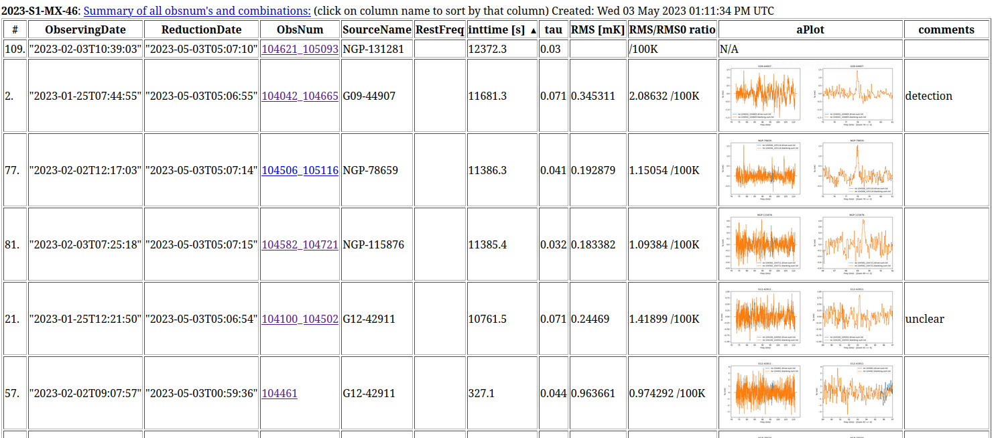

# viewing an RSR summary page

The summary page for an RSR based projects
shows a number of columns, including a summary figure of the spectrum (full and zoomed). 

Here
are some suggested ways to start viewing the summary page, recalling that the top row can be clicked on to sort
that column:

1. Sort by **inttime**, this should immediately bring the final spectra to the top. Otherwise you would be
   viewing individual obsnums, not the combinations (stacked). The **ObsNum** column will then show the 
   first and last obsnum separated with an underscore, e.g. 104042_104665

2. Sort by **SourceName**.  This will expose the individual obsnums, so it can be checked if the combinations
   did not include suspicious obsnums.   

3. Sort by **RMS** and/or **RMS/RMS0 ratio**, and check the observations with large RMS.  For RSR they should be around 
   1 mK for the usual 300sec integration.  The ratio RMS/RMS0 that checks the radiometer equation should be near 1.0 

4. Sort by **comments** to see which observations got comments

5. Once you clicked on an *obsnum* (or *obsnum_obsnum* combination), a summary of the 
   Timely Analysis Products (TAPS) for this observation is given.
   For single *obsnum*s notable things to pay attention to are:
   
   1. System Temperature - without and with badlags applied (not the badcb= ) -
      this plot is only given for individual *obsnum*

   2. BadLags -
      this plot is only given for individual *obsnum*   

   3. Waterfall Plot and Final Spectrum 

   4. Final Specrum (full, and zoomed to a range the PI can change)

   5. Links to various log files, including the ASCII spectra, and a peak detection log file

   6. At the bottom of the page is a brief summary of the RSR, and an observing guide.

