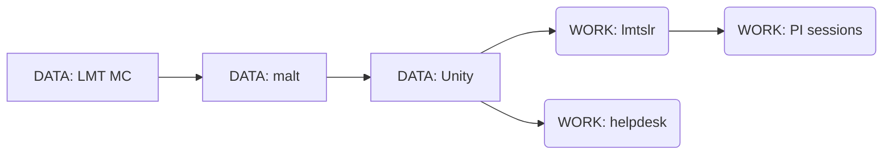
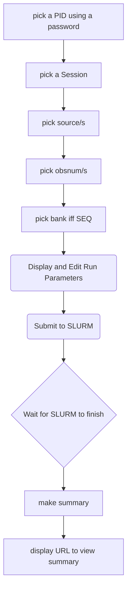

# Running SLpipeline via a web interface

At the moment this is a discussion document. The source code for the
webrun environment is currently in
development in: https://github.com/lmtmc/pipeline_web


A nicely formatted version of this document should be in:
https://github.com/astroumd/lmtoy/blob/master/docs/webrun.md


## Reminder of nomenclature in the LMTOY environment in this document

Some of these are environment variables, others so noted for convenience

      $DATA_LMT   - root directory of the read-only raw data
      $WORK_LMT   - root directory of the session's working area
      $PID        - LMT's *ProjectId*  (e.g.  2023-S1-UM-10)
      $OBSNUM     - observation number (e.g.  123456)
      $SRC        - Source Name
      $PIS        - PI session name  (a new concept in *webrun*)

## Overview for the lmtslr user:

This is how the pipeline is normally run via a CLI from the main *lmtslr* account
(this can be lmtslr_umass_edu or lmthelpdesk_umass_edu)

First a description: we start from the directory where the project
script generator lives, we generate run files for this project and submit
them to SLURM. Note that each (sbatch_lmtoy.sh) command here can only
be run when the previous command has finished! We have an experimental
sbatch_lmtoy2.sh command that can  wait between runfiles.

      cd $WORK_LMT/lmtoy_run/lmtoy_$PID     (alternative command:  cdrun $PID)
      git pull
      make runs
          [should find out which run files there are to run]
      sbatch_lmtoy.sh $PID.run1a
      sbatch_lmtoy.sh $PID.run1b
      sbatch_lmtoy.sh $PID.run1c  [if need]
      sbatch_lmtoy.sh $PID.run2a
      sbatch_lmtoy.sh $PID.run2b  
      sbatch_lmtoy.sh $PID.run2c  [if need]
      make summary
      make index
      xdg-open https://taps.lmtgtm.org/lmtslr/$PID

If a user doesn't care that  the terminal is blocked (e.g. in a VNC session) one can use
something like this example
 
      sbatch_lmtoy2.sh $PID.run1a $PID.run1b $PID.run2a $PID.run2b

and as a bonus it will also run the summary and index at the end!

This is the typical workflow for the pipeline operator, as well as for the DA.

The work results for this PID will be in $WORK_LMT/$PID, but is available
to the PI at https://taps.lmtgtm.org/lmtslr/$PID (a PI password is needed
until the data is public).
 
The PI webrun will essentially do the same thing, but in a new hierarchy
for just that single PID, and underneath a new $WORK_LMT/$PID/session/ tree, as
summarized below.

Important and still missing is a mechanism that will have each tier (run1a, run1b, run2a etc.) wait
until all jobs are done before the next runfile can be submitted.

## Directory hierarchy:

Following this convention we arrive at the following proposed directory hierarchy

     ..../work_lmt/                                       top level WORK_LMT used by pipeline
                   lmtoy_run/lmtoy_PID/                   script generator used by pipeline
                   PID/                                   The PI has web-read-access to this tree via index.html
		       dir4dv/                            temporary files for archive submission (not needed for webrun)
		       dirzip/                            ZIP files of the SRDP and SDFITS data (links to these will be provided)
                       O1/                                obsnum directories with full results of pipeline
                       O2/
                       ..
                       session.dat                        this file contains session entries "1" and "2"
                       Session-1/                         PIS=session-1 is the new WORK_LMT for this webrun session
                                 lmtoy_run/lmtoy_PID/
                                 PID/O1/                  only one PID in this session
                                     O2/
                                     ..
				     dirzip/              ZIP files
                       Session-2/lmtoy_run/lmtoy_PID/     PIS=session-2 is the new WORK_LMT for this webrun session
                                 PID/O1/
                                     O2/
                                     ..
				     dirzip/


      
## Overview of steps

Command Line (CLI) equivalent commands are given where this makes sense:

1. User logs in and authenticates for a given PID.

   Examples of PIDs:    "2023-S1-MX-1"
                        "2022S1RSRCommissioning"

   CLI equivalent: (there is no authentication needed within the shell of the CLI)
   
           PID=2023-S1-MX-1


2. If multiple sessions were available for this project, pick one, or allow
   a new one to be cloned.  There will always be one session, the one that
   was prepared for the DA's for the PI. It cannot be modified though, only
   cloned.

   CLI equivalent (notice we only redefine the WORK_LMT):

           PIS=1
     	   export WORK_LMT=/nese/toltec/dataprod_lmtslr/work_lmt/$PID/Session-$PIS
           mkdir -p $WORK_LMT
           cd $WORK_LMT
           lmtoy_run $PID
	   cd lmtoy_run
	   make git GIT_DIRS=lmtoy_$PID
	   cd lmtoy_$PID
	   edit mk_runs.py 
	   make runs
	   sbatch_lmtoy.sh *run1a
	   ...


   this will create (or re-use) the $WORK_LMT/$PID directory and the pipeline is now
   set up with the script generator and a default run can be submitted.
   webrun has exclusive read/write in this new WORK_LMT tree

3. Interface returns a list of sources that can be worked on, user picks *one or more*.

   CLI equivalent for one SRC:

           lmtinfo.py grep $PID | tabcols - 6 | sort | uniq -c
           cd $WORK_LMT/lmtoy_run/lmtoy_$PID
           make runs
           grep $SRC *.run1a > test1
           grep $SRC *.run2a > test2

   (append more for more SRC)
           

4. Interface returns a list of obsnums, and their PI/PL's how the script generator
   had last decided it was going to be run, e.g.

   obsnum=123456 badcb=1/2,3/4 cthr=0.02
   obsnum=123457 trhr=0.015
   obsnums=123456,123457 
   
   These can be edited and submitted via SLURM.    Single obsnum= runs - by definition -
   can be run in parallel.
   Combination obsnums= need to wait before the single ones are done, but for multiple
   sources, can be run in parallel as well.
   For SEQ multiple banks need to be run serially.
   
   In the command line version these are the "run1" and "run2" files, e.g.

        sbatch_lmtoy.sh *.run1a
   and
        sbatch_lmtoy.sh *.run2a

   **NOTE**:  this section needs a session managment where the status of the keywords belonging
   to an obsnum are recorded and picked up the next iteration. Valid keywords need to be provided
   since they are instrument specific.

5. After submission of jobs, relevant summary listings are updated, and can be viewed online

   CLI equivalent:

        make summary

   the PI can then compare the pipeline results in

        https://taps.lmtgtm.org/lmtslr/2018-S1-MU-45/84744

   with their webrun in

        https://taps.lmtgtm.org/lmtslr/2018-S1-MU-45/Session-1/2018-S1-MU-45/84744

   One could argue the 2nd 2018-S1-MU-45 is superfluous, but the problem is that the pipeline
   expects a PID below a WORK_LMT


6. See also challenged at the end of this document


## Example scenarios

The current lmtoy/docs/ui slides suggest the following workflow, perhaps in a Previous/Next series?

This is the suggested workflow for SEQ/Map

1. sessions:  select a session
2. sources:   select one or more sources, and a bank if applicable
3. obsnums:   select one or more obsnums, (and what about freq setup)
4. beams (SEQ): select which beams to keep, and what time ranges to reject
5. baselines (SEQ): select spectral range where baselines are to be measured
6. calibrations (SEQ): how spectra are calibrated
7. gridding (SEQ): how map is gridded: mapsize, resolution, cell
8. output:  overall flow, output products etc.


###  Simple one-source project


###  Multiple sources

The PI will want to experiment and compare an OTF map made from the standard pipeline
and a modified one where beam 10 was also removed.  Inspecting the standard pipeline showed
that beams 0 and 5 were removed,

     cd $WORK_LMT/lmtoy_run/lmtoy_2021-S1-MX-3                # get to the script generator
     make runs                                                # ensure we have the latest run files
     grep Arp91 *.run1b > test1                               # exctract just that source (and/or bank)
     grep Arp91 *.run2b > test2                               # exctract just that source (and/or bank)     
     awk '{print $0,"pix_list=-0,5,10"}' test1 > test1a       # add the new pix_list
     sbatch_lmtoy.sh test1a                                   # submit individual obsnums
     <wait till this SLURM job done>
     sbatch_lmtoy.sh test2                                    # submit combination obsnums
     <wait till this SLURM job done>
     make summary


## Data

Summarizing the LMT data flow:



where currently we have

```

            DATA_LMT                                WORK_LMT
 LMT_MC:    ???                                             -
 
 malt:      /home/lmtslr/data_lmt3                  /home/lmtslr/work_lmt
 unity:     /nese/toltec/dataprod_lmtslr/data_lmt   /nese/toltec/dataprod_lmtslr/work_lmt
                                                    /nese/toltec/dataprod_lmtslr/work_lmt_helpdesk/peter
                                                    /nese/toltec/dataprod_lmtslr/work_lmt_helpdesk/pipeline_web
 lma:       /lma1/lmt/data_lmt/                     /lma1/teuben/LMT/work_lmt
```

## Workflow Examples

###  



## Challenges beyond the default spectral line pipeline (SLPL)

Here are some more advanced features the pipeline could/should do, and that a PI might be interested in.

1. Combining data from different projects. Already tricky in SLPL, but not impossible.  Has authentication issues.

2. Set more complex baseline/line sections (e.g. MX-37). Needs to set b_regions, l_regions, slice, v_range

3. Set multiple VLSR and extract multiple lines (e.g. MX-37). Easier to do in web_run because of sessions

4. Combine fields into a mosaiced field (e.g. MX-2, US-20). Fairly simple in script generator, but not provided in default pipeline?

5. Should we allow a raw extraction? Time-out grace period - resource management - how many jobs

6. Run a single bank pipeline from start. Normally it's both, then new tiers on each bank.

### Things webrun must not do

1. no meta data construction (meta=0) and archive ingestion (no need for a dir4dv directory)


